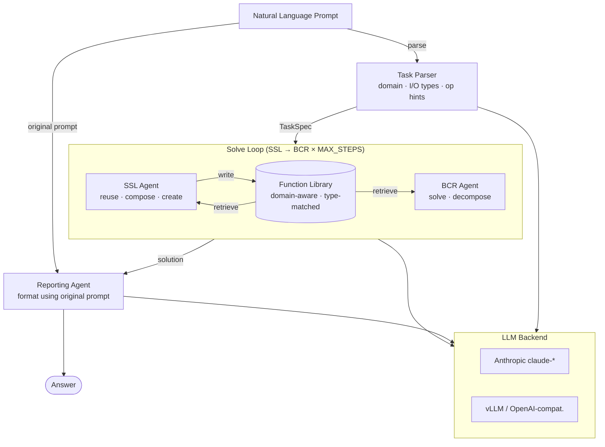

# Symbolic Library Agent

An agentic system for symbolic inductive reasoning that builds and reuses a shared library of Python functions across tasks — inspired by DreamCoder.

---

## Architecture



All agents communicate with the LLM via **plain JSON responses** — no tool-calling API. Each agent's expected output schema is embedded in its system prompt. The OpenAI backend uses `response_format={"type":"json_object"}` for hard JSON guarantees; both Anthropic and OpenAI paths work identically from the agent's perspective.

---

## Project Structure

```
symbolic-library-agent/
├── symbolic_agent/
│   ├── __init__.py
│   ├── models.py           # Function dataclass, make_state()
│   ├── library.py          # FunctionLibrary — add, retrieve, format
│   ├── costs.py            # CostTracker — α·NewFuncs + β·Length + γ·Redundancy − δ·Reuse
│   ├── executor.py         # safe_exec, execute_with_library (sandboxed Python)
│   ├── llm_client.py       # LLMClient — Anthropic + OpenAI/vLLM, returns parsed dicts
│   ├── task_parser.py      # NL → TaskSpec (domain, I/O types, hints)
│   ├── ssl_agent.py        # SSL agent — library management
│   ├── bcr_agent.py        # BCR agent — solve / decompose
│   ├── reporting_agent.py  # Reporting agent — format final answer
│   ├── controller.py       # Main controller loop
│   └── baselines/
│       ├── trove/          # TroVE online function induction (--framework trove)
│       ├── regal/          # ReGAL offline refactoring (--framework regal)
│       ├── react_mem/      # ReAct + episodic memory (--framework react_mem)
│       └── best_of_k/      # Best-of-K sampling (--framework best_of_k)
├── examples/
│   └── tasks.py            # Built-in example tasks
├── scripts/
│   ├── mock_tasks.jsonl    # Sample JSONL task file for testing
│   ├── run_agent_vllm.sh   # run the agent for data generation with vLLM
│   └── test_vllm.sh        # Quick vLLM smoke-test
│
│
├── docs/                   # Detailed documentation
├── main.py                 # CLI entry point
├── requirements.txt
└── .env                    # ANTHROPIC_API_KEY (not committed)
```

---

## Setup

```bash
pip install -r requirements.txt
```

Create a `.env` file — add the key(s) for the backends you want to use:

```
ANTHROPIC_API_KEY=sk-ant-...   # for claude-* models
OPENAI_API_KEY=sk-...          # for gpt-4o / o1 / o3 (--backend openai)
VLLM_API_KEY=EMPTY             # optional, for local vLLM
```

Optional — better memory retrieval for `react_mem`:
```bash
pip install rank_bm25             # fast BM25 retrieval
pip install sentence_transformers # semantic embedding retrieval
```

---

## Usage

### Anthropic API

```bash
# List built-in example tasks
python main.py --list

# Run a single built-in task
python main.py --task 0

# Run all built-in tasks in batch (library shared across tasks)
python main.py

# Run tasks from a JSONL file
python main.py --tasks-file scripts/mock_tasks.jsonl

# Write output JSONL (live, one line per task)
python main.py --tasks-file tasks.jsonl --output-file results.jsonl

# Print library stats after the run
python main.py --stats

# Use a specific model
python main.py --model claude-opus-4-6 --task 0
```

### Local vLLM

```bash
# Start a vLLM server
vllm serve openai/gpt-oss-120b --port 8002

# Run against it
python main.py --base-url http://localhost:8002/v1 \
               --model openai/gpt-oss-120b \
               --tasks-file scripts/mock_tasks.jsonl

# Quick smoke-test
bash scripts/test_vllm.sh
```

If your vLLM server requires an API key:

```bash
export VLLM_API_KEY=your-key
```

### All CLI flags

**Framework and model:**

| Flag | Default | Description |
|---|---|---|
| `--framework NAME` | `ssl_bcr` | `ssl_bcr` · `trove` · `regal` · `react_mem` · `best_of_k` |
| `--model NAME` | `claude-sonnet-4-5` | Model name. Aliases: `sonnet`, `opus`, `haiku`, `gpt4o`, `gpt4omini` |
| `--backend NAME` | auto | `anthropic` · `openai` · `vllm`. Auto-inferred from model name and `--base-url` |
| `--base-url URL` | — | OpenAI-compatible endpoint for vLLM (e.g. `http://localhost:8002/v1`) |

**Token budget:**

| Flag | Default | Description |
|---|---|---|
| `--max-tokens N` | per-agent | Base max_tokens/call (SSL: 2048, BCR: 4096, Reporting: 1024) |
| `--max-tokens-complex N` | per-agent | Max_tokens for complex tasks (SSL: 4096, BCR: 8192, Reporting: 2048) |
| `--max-tokens-patch N` | `16384` | Max_tokens for neural patch call |
| `--max-tokens-parser N` | `512` | Max_tokens for TaskParser call |
| `--show-projected-budget` | off | Print projected max token budget per task, then exit |
| `--max-reward-iters N` | `3` | Max reward-feedback iterations (ssl_bcr, react_mem) |

**General:**

| Flag | Default | Description |
|---|---|---|
| `--task N` | — | Run a single built-in task by index |
| `--list` | — | List built-in example tasks |
| `--tasks-file FILE` | — | Run tasks from a JSON or JSONL file |
| `--budget FLOAT` | `15.0` | Step budget per task (ssl_bcr) |
| `--lam FLOAT` | `0.3` | λ regularisation weight |
| `--output-file FILE` | — | Append each completed task to a JSONL file (includes `token_usage`) |
| `--default-reward NAME` | — | Reward module for all tasks (e.g. `reasoning_gym`, `pbebench`) |
| `--debug-dir DIR` | — | Per-call LLM debug logs |
| `--stats` | — | Print library/cost stats after the run |

**Framework-specific:**

| Flag | Framework | Default | Description |
|---|---|---|---|
| `--trove-k K` | trove | `5` | Samples per mode |
| `--trove-trim-every N` | trove | `500` | Trim toolbox every N tasks |
| `--react-mem-k K` | react_mem | `3` | Memory examples retrieved per task |
| `--react-max-steps N` | react_mem | `5` | ReAct steps per task |
| `--bok-k K` | best_of_k | `5` | Independent attempts per task |
| `--regal-train-file FILE` | regal | — | Training JSONL with `program` key |

### Baselines

Five frameworks are available via `--framework`:

| Framework | Description | Key flags |
|---|---|---|
| `ssl_bcr` | SSL + BCR symbolic library agent (default) | `--max-reward-iters`, `--lam` |
| `trove` | TroVE: online function induction | `--trove-k`, `--trove-trim-every` |
| `regal` | ReGAL: offline refactoring + code bank | `--regal-train-file`, `--regal-retrieval` |
| `react_mem` | ReAct agent + episodic memory retrieval | `--react-mem-k`, `--react-max-steps` |
| `best_of_k` | K independent samples, best by reward | `--bok-k` |

**Compute matching:** to compare baselines at equal token budget, set each framework's `K × max_tokens` to the same value. Example — matching ssl_bcr at `3 iters × 8192 tokens`:
- `best_of_k --bok-k 3 --max-tokens 8192`
- `react_mem --max-reward-iters 3 --max-tokens 4096 --react-max-steps 2`

Show the projected budget formula without running:
```bash
python main.py --framework ssl_bcr --max-tokens 4096 --max-reward-iters 3 --show-projected-budget
```

---

## Task File Formats

**JSONL** (one object per line):
```jsonl
{"prompt": "Given a list of integers, return only the even numbers.", "type": "list_transform"}
{"prompt": "Reverse a list.", "type": "list_transform"}
{"prompt": "Return the sum of all elements in a list."}
```

**JSON** (array):
```json
[
  {"prompt": "Given a list of integers, return only the even numbers.", "type": "list_transform"},
  {"prompt": "Reverse a list."}
]
```

Each record requires a `prompt` key. Optional keys:

| Key | Visible to agents | Description |
|---|---|---|
| `type` | no | Task category label (default: `"symbolic"`) |
| `question` | yes | Concise question string (reasoning_gym style). BCR displays this instead of `prompt` to avoid redundant few-shot context in the agent prompt. |
| `task` | yes | Short task-type label (e.g. `"caesar_cipher"`). Passed to agents as context. |
| `reward` | no | Reward module name (e.g. `"reasoning_gym"`, `"pbebench"`). Enables the closed-loop reward feedback for this task. See [Reward Loop](#reward-loop). |
| any other keys | no | Passed through to the reward function as part of `entry` but **never shown to agents** — safe to include oracle fields like `answer`, `programs`, `metadata`. |

> **Oracle leakage prevention:** agents only ever see `question`, `prompt`, and `task` from the record. All other keys (including ground-truth answers) are stripped from `task_input` before any agent call and are only accessible to the reward function via the full `entry` dict.

---

## Reward Loop

When a task record has a `reward` field (or `--default-reward` is set), the controller uses `solve_with_reward()` instead of `solve()`. It iterates up to `--max-reward-iters` times, feeding the reward signal back to BCR after each attempt:

```
solve attempt → execute → reward_fn(result, ok, entry) → reward < 1.0?
    └─ BCR gets reward history + "fix mode" prompt → retry
```

Reward functions live in `rewards/{name}.py` and must implement:

```python
def reward(result: Any, execution_ok: bool, entry: dict) -> dict:
    return {"value": float, "message": str}  # message is optional
```

`rewards/reasoning_gym.py` covers all 104 reasoning_gym task types via `get_score_answer_fn(source_dataset)`.

To run reasoning_gym tasks with the reward loop:

```bash
# Add "reward": "reasoning_gym" to each record, or use --default-reward:
python main.py --tasks-file data/reasoning_gym/easy_pilot_tasks.jsonl \
               --default-reward reasoning_gym \
               --max-reward-iters 3 \
               --output-file outputs/reasoning_gym_easy.jsonl
```

---

## Output Files

`--output-file results.jsonl` appends one JSON line per task **immediately** after each task completes. Each line combines:
- **response** — answer, explanation, confidence, execution result
- **trajectory** — task spec, agent trace, solution code, library snapshot, cost summary
- **agent_messages** — every LLM call during the task (system prompt, user message, raw response, parsed result) — useful as agentic training data
- **reward fields** — `reward_history`, `best_reward`, `final_reward` (populated when a reward is set)

```jsonl
{"task_index": 0, "solved": true, "answer": "[2, 4, 6]", "trace": [...], "agent_messages": [...]}
{"task_index": 1, "solved": true, "answer": "6", "best_reward": 1.0, "reward_history": [...], ...}
```

`--debug-dir debug_logs/` writes one JSON file per LLM call, including the model's chain-of-thought (`reasoning_content`) and parsed result. Files are written immediately so they survive crashes:

```
debug_logs/run_20260318T060621/
├── 0001_task_parser_...json
├── 0002_ssl_...json
├── 0003_bcr_...json
└── 0004_reporting_...json
```

---

## Evaluating Results

After a run, use the eval scripts to compute per-instance and summary metrics.

### Quick start

```bash
# Evaluate one or more output files (summary + CSV + plots)
bash scripts/run_eval.sh outputs/pbebench_lite_pilot_tasks_with_rewards.jsonl

# Multiple files at once (adds a combined summary)
bash scripts/run_eval.sh outputs/pbebench_lite*.jsonl outputs/reasoning_gym*.jsonl

# Default: evaluates all *.jsonl files found in outputs/
bash scripts/run_eval.sh
```

Outputs written to:
- `outputs/eval.csv` — per-instance table (one row per task)
- `outputs/eval_plots.png` — 2×3 summary figure

### Metrics computed

| Metric | Description |
|---|---|
| `best_reward` | Highest reward value achieved across all iterations (0–1) |
| `task_loss` | `1 - best_reward` |
| `solved` | Whether `solved=True` in the output record |
| `num_iters` | Number of reward-loop iterations used |
| `first_perfect_iter` | Iteration index where reward first hit 1.0 (null if never) |
| `blame_sequence` | Chain of blame labels e.g. `execution→partial→partial` |
| `total_cost` | Library cost for this task (α·new\_fns + β·length + γ·redundancy − δ·reuse) |
| `objective` | `task_loss + λ·total_cost` |
| `num_new_functions` | Functions added to the library during this task |
| `reuse_count` | Times existing library functions were reused |

### Advanced usage

```bash
# Print per-instance table to stdout
python scripts/eval.py outputs/my_run.jsonl --per-instance

# Save CSV to a custom path
python scripts/eval.py outputs/my_run.jsonl --csv results/my_run_eval.csv

# Custom plot output and resolution
python scripts/plot_eval.py outputs/my_run.jsonl --out results/plots.png --dpi 200
```

---

## Cost Function

```
TotalCost = α·NumNewFunctions + β·TotalFunctionLength
          + γ·RedundancyPenalty − δ·ReuseReward

Objective = TaskLoss + λ·TotalCost
```

| Weight | Symbol | Default |
|---|---|---|
| NumNewFunctions | α | 1.0 |
| TotalFunctionLength | β | 0.05 |
| RedundancyPenalty | γ | 2.0 |
| ReuseReward | δ | 0.5 |
| Regularisation | λ | 0.3 |

---

## Key Behaviours

- **Reuse over invention** — SSL checks the library before creating anything new
- **Domain-aware retrieval** — functions are scored by text similarity, domain affinity, type overlap, and usage count; a `list_manipulation` function transfers to `sequence` tasks but not to `math` or `chess`
- **Cross-task library sharing** — batch mode accumulates a growing library; later tasks can reuse primitives built for earlier ones
- **Direct answers for Q&A tasks** — BCR's `direct` action lets it apply a library function mentally and return the answer string without writing any code. Instance-specific solve wrappers never pollute the library; only reusable primitives are stored.
- **Robust JSON parsing** — agents tolerate imperfect model output: markdown fences are stripped, common field-name aliases are accepted, function names are inferred from `def` lines
- **Safe execution** — generated code runs in a sandboxed namespace; dangerous imports (`os`, `sys`, `subprocess`, etc.) are blocked at the AST level

---

## Documentation

Detailed documentation is in the [`docs/`](docs/) folder:

- [Architecture and control flow](docs/architecture.md)
- [Agent reference (schemas, inputs/outputs, fallbacks)](docs/agents.md)
- [Data structures (State, Function, TaskSpec, CostTracker)](docs/data-structures.md)
- [LLM client (backends, JSON mode, debug logging)](docs/llm-client.md)
- [Library retrieval (scoring, domain affinity matrix)](docs/library-retrieval.md)
- [Code execution (sandbox, safe_exec)](docs/execution.md)
- [Debugging guide (debug logs, output files, failure modes)](docs/debugging.md)
- [Adding tasks (formats, prompt guidelines, evaluation)](docs/adding-tasks.md)
- [Output file format (JSONL schema, checkpoint, execution_result shapes)](docs/output-format.md)
