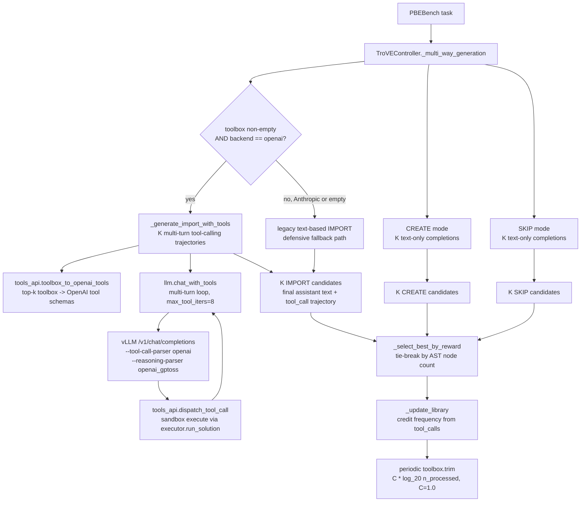
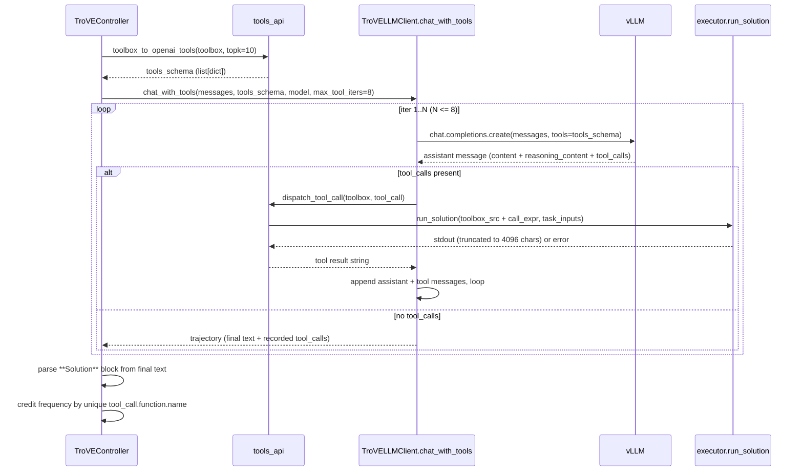

# TroVE Native Tool Calling — Design Spec

**Date:** 2026-04-25
**Branch:** `trove_baseline`
**Status:** Approved (sectional review complete; self-review applied)

---

## 1. Problem statement

Our existing TroVE port (`symbolic_agent/baselines/trove/*`) faithfully implements the original 3-mode generation (IMPORT / CREATE / SKIP) via free-form text prompts. When run on PBEBench with `gpt-oss-20b` / `gpt-oss-120b` served via vLLM, two failure modes are observed:

1. **The toolbox is populated but never used.** The model emits `**Toolbox**` and `**Solution**` blocks that ignore previously-induced functions even when those functions match the task family. CoT shows the model "discovering" the same primitive sequence repeatedly.
2. **CoT and final code are decoupled.** Even when the prompt names a toolbox helper, the model's reasoning channel does not interleave concrete invocations of that helper — calls only appear (if at all) in the final code, with no per-call signal we can audit.

The user requirement is: **the model's chain-of-thought should interleave with concrete function calls into the induced toolbox**. The mechanism for this is **native OpenAI tool calling**: the toolbox is exposed via the `tools=[...]` parameter of `chat.completions.create`, and the model emits structured `tool_calls` during its reasoning that vLLM dispatches back to us. Each tool call is real, auditable, and credited toward toolbox frequency.

This spec adapts the IMPORT mode of TroVE to use that mechanism, while keeping CREATE and SKIP modes text-based and preserving the rest of the algorithm faithful to the paper.

---

## 2. Goals and non-goals

### Goals

- IMPORT-mode trajectories are produced by a multi-turn loop where `gpt-oss` calls toolbox functions natively via `tool_calls`.
- Frequency credit reflects what the model actually called, not what appeared in text.
- The 3-way generation (IMPORT, CREATE, SKIP), K-sampling, reward-based candidate selection, AST tie-breaking, and `C·log_{20}(n)` trimming all remain faithful to the original TroVE algorithm.
- The smoke run produces enough telemetry (per-task `tool_calls` lists, per-mode wins, function-frequency table) to attribute any accuracy delta vs. the no-toolbox baseline to actual tool usage.
- "Done" = code complete + 50-task PBEBench-Lite smoke run on `gpt-oss-20b` + numbers reported. **No prompt iteration to chase performance targets.**

### Non-goals

- We do not change CREATE or SKIP mode generation. They remain single-shot text completions exactly as today.
- We do not pre-seed the toolbox.
- We do not change reward semantics, the PBEBench harness, or the executor's I/O contract.
- We do not chase a specific accuracy target. Per the original TroVE methodology, we report what the algorithm produces.
- We do not test or report Anthropic backend numbers — only vLLM-served `gpt-oss`.

---

## 3. Architecture overview



**One-line summary:** Only the IMPORT branch changes. Everything else (CREATE, SKIP, K-sampling, selection, library updates, trimming) stays where the existing port already has it.

---

## 4. Data flow for IMPORT-with-tools



---

## 5. Components

### 5.1 New file: `symbolic_agent/baselines/trove/tools_api.py`

Two pure functions; no state.

**`toolbox_to_openai_tools(toolbox: TroVEToolbox, topk: int = 10) -> list[dict]`**

- Selects the top-k entries by frequency (matching the existing `format_toolbox(topk=10)` view).
- For each entry, executes the toolbox source via `exec(toolbox.get_full_code(), namespace)` into a fresh dict, then reads `inspect.signature(namespace[fn_name])` to enumerate parameters and annotations.
- Builds an OpenAI `chat.completions` tool dict:
  ```json
  {
    "type": "function",
    "function": {
      "name": "<fn_name>",
      "description": "<docstring or empty string>",
      "parameters": {
        "type": "object",
        "properties": {"<param>": {"type": "<inferred>"}, ...},
        "required": [<all params without defaults>]
      }
    }
  }
  ```
- Type inference: `int → integer`, `float → number`, `bool → boolean`, `list/tuple → array`, `dict → object`, anything else (or unannotated) → `string`. Numeric and string defaults: pass through to the schema as `default`. Anything else: omit the default.
- Functions with `*args` or `**kwargs` are excluded from the tool list (we cannot generate a meaningful schema; this is rare for induced TroVE helpers and is logged to the debug dir for inspection).

**`dispatch_tool_call(toolbox: TroVEToolbox, tool_call) -> str`**

- Sanitizes the tool name: `name = tool_call.function.name.split("<|", 1)[0]`. This is a defensive 2-line workaround for the open vLLM bug tracked by PR #35906 (Harmony control tokens leaking into tool names like `find_replace_chain<|channel|>commentary`). If/when #35906 lands upstream, this becomes a no-op.
- If `name` is not in `toolbox`, returns the JSON string `{"error": "tool '<name>' not in toolbox"}` (the model can recover).
- Parses `tool_call.function.arguments` as JSON; on parse error returns `{"error": "argument JSON parse failed: <msg>"}`.
- Builds a one-liner call expression: `print(repr(<name>(**<args>)))`.
- Runs `executor.run_solution` with `toolbox.get_full_code() + "\n" + call_expr` and `inputs={}`. (PBEBench task inputs are not needed at the function-call level — the model passes inputs as arguments.)
- Returns the captured stdout truncated to **4096 characters** (UTF-8 codepoints, not bytes — simpler to truncate without splitting a codepoint), or the error message on non-zero exit.

### 5.2 Modify: `symbolic_agent/baselines/trove/llm.py`

**`TroVELLMClient._call_openai`**

- After reading `response.choices[0].message.content`, fall back to `getattr(response.choices[0].message, "reasoning_content", "")` when `content` is empty/None. This handles `gpt-oss` Harmony channel splits where the answer lands in the reasoning channel for non-tool-calling text completions (CREATE, SKIP, and legacy IMPORT). No change to the function signature.

**New method: `TroVELLMClient.chat_with_tools(messages, tools, model, max_tokens, max_tool_iters=8, on_tool_call, tag) -> dict`**

- Returns `{"final_text": str, "tool_calls": list[dict], "iterations": int, "stopped_reason": str}`.
  - `final_text` is the assistant message content from the final iteration (`""` if none).
  - `tool_calls` is the ordered list of recorded calls, each `{"name": str, "args_preview": str (≤200 chars), "result_preview": str (≤200 chars), "ok": bool}`.
- Implements the multi-turn loop:
  1. Append the user message.
  2. POST `chat.completions.create(model, messages, tools, tool_choice="auto", max_tokens)`.
  3. If `message.tool_calls` is empty: record `final_text` (with `reasoning_content` fallback) and return.
  4. Otherwise: append the assistant message verbatim, then for each `tool_call` invoke `on_tool_call(tool_call)` (the controller passes a closure that calls `tools_api.dispatch_tool_call`). Append a `{"role": "tool", "tool_call_id": ..., "content": <result>}` message per call.
  5. Increment iteration counter; if `iterations >= max_tool_iters`, stop with `stopped_reason="max_iters"` and return what we have.
- Defensive guard: raises `NotImplementedError("chat_with_tools requires the openai backend")` on `self.backend == "anthropic"`. This guard is **never tripped in normal flow** because the controller branches on `self.backend == "openai"` before calling. It exists only to fail loudly if a future caller invokes the method directly.
- Uses the same 3-attempt retry, the same per-call debug logging (writing one JSON file per LLM round-trip into the existing `_debug_dir` with the tag suffixed by `_iter{n}`), and the same token accounting as `_call_openai`.

### 5.3 Modify: `symbolic_agent/baselines/trove/controller.py`

**`__init__`** — add two parameters:
- `task_family: str = "default"` — passed through to `prompts.build_*_prompt` and `parse.parse_response`.
- `selection: str = "reward"` — `"reward"` (default) uses the existing `_select_best_by_reward`; `"consistency"` uses the existing `_select_best_by_consistency`.

**`_multi_way_generation`** — change the IMPORT branch only:
- If `self.backend == "openai"` AND `len(self.toolbox) > 0`: call new `_generate_import_with_tools(task, K)`.
- Else: call the existing legacy text-based IMPORT path. (Anthropic and empty-toolbox both fall through here; the latter is correct because there are no tools to expose anyway.)
- CREATE and SKIP branches: unchanged.

**New method: `_generate_import_with_tools(task, K) -> list[Candidate]`**

- Builds the IMPORT-with-tools prompt via `prompts.build_import_with_tools_prompt(task, task_family=self.task_family)` (no `**Toolbox**` markdown — the toolbox is conveyed via the `tools=[...]` parameter).
- Builds the tool schema once per task: `tools_schema = tools_api.toolbox_to_openai_tools(self.toolbox, topk=10)`.
- For `i in range(K)`, calls `self.llm.chat_with_tools(...)` with the tag `f"trove_import_{task.id}_{i}"`.
- Each returned trajectory becomes one Candidate. Solution code is parsed from the final text via `parse.parse_response(final_text, task_family="pbebench")` (strict `**Solution**` block; no fallback to "any python block").
- Empty `final_text` → empty solution code → reward=0 → naturally loses in selection.

**`_update_library`** — for `mode == "import"`, credit frequency by **unique `tool_call.function.name`** entries in the trajectory:
- `unique_names = {sanitize(tc["name"]) for tc in trajectory.tool_calls}` where `sanitize` is the same `<|`-truncation used in `dispatch_tool_call` (defensive symmetry).
- For each name, call `self.toolbox.update_frequency(name, example_idx)`. Names not present in the toolbox are silently no-ops thanks to the existing filter at `toolbox.py:68` — hallucinated tool names contribute nothing to frequency. Real tool calls (names matching a toolbox entry) get one credit per task per unique name.

**`_make_result`** — emit passive telemetry fields per task. Add to the result dict (no behavior changes):
- `won_mode: "import" | "create" | "skip"`
- `import_eligible: bool` (true iff toolbox was non-empty when the task ran)
- `import_was_winner: bool`
- `tool_calls: list[{name, args_preview, result_preview, ok}]` (only populated when the IMPORT-with-tools path ran)
- `tool_call_count: int`
- `tools_called: list[str]` (unique names actually called)
- `actually_called: list[str]` (functions from `toolbox` that appear as call-sites in the AST of the winning `**Solution**` code; computed via `parse.imported_callsites`)

### 5.4 Modify: `symbolic_agent/baselines/trove/parse.py`

**New helper: `imported_callsites(solution_code: str, tools_code: str, candidate_names: set[str]) -> set[str]`**
- AST-walks `solution_code`, returns the subset of `candidate_names` that appear as `Call` targets (handles bare `Name` and `Attribute` callees like `toolbox.find_replace_chain`).
- Used by `_make_result.actually_called`.

**Modify `parse_response`** — add `task_family: str = "default"` parameter:
- For `task_family == "pbebench"`, do not fall back to `_extract_any_python_block` if the `**Solution**` block is missing — return empty solution code instead. This enforces strict format adherence and prevents the parser from accidentally promoting CoT scratchpad to the answer.
- For all other families, behavior is unchanged.

### 5.5 Modify: `symbolic_agent/baselines/trove/prompts.py`

- Add PBEBench-shaped few-shot examples: `_CREATE_EXAMPLE_PBEBENCH` and `_SKIP_EXAMPLE_PBEBENCH`. Each demonstrates a sequence of `replace()` operations and (in CREATE's case) a small reusable helper such as `find_replace_chain(s, pairs)` so the model has a concrete pattern to imitate.
- Add **`_IMPORT_INSTRUCTION_FOR_TOOLS`** and **`_IMPORT_EXAMPLE_FOR_TOOLS`**: the prompt for IMPORT-with-tools mode. These do *not* include a `**Toolbox**` markdown block (the toolbox is conveyed via the `tools=[...]` parameter). They instruct the model to use the available tools when helpful and to produce a final answer in a `**Solution**` block.
- Add **`build_import_with_tools_prompt(task, task_family)`** and refactor `build_import_prompt`, `build_create_prompt`, `build_skip_prompt` to accept `task_family` and dispatch to the appropriate example set.
- Make `_FORMAT_OVERRIDE` conditional: empty string for `task_family == "pbebench"` (the new PBEBench examples model the desired format directly); existing override for other families.

### 5.6 Modify: `symbolic_agent/baselines/trove/toolbox.py`

- `TroVEToolbox.trim`: change default `C: float = 0.5` → `C: float = 1.0` to match the original TroVE implementation.

### 5.7 Modify: `symbolic_agent/baselines/trove/executor.py`

- `DEFAULT_TIMEOUT = 10` → `DEFAULT_TIMEOUT = 60`. Closer to the original TroVE's ~100s; gives PBEBench's `replace()`-chain solutions and the multi-turn tool dispatch enough headroom on local vLLM.

### 5.8 Modify: `main.py`

- Add CLI flag `--trove-selection {reward,consistency}` with `default="reward"`. Plumb to `TroVEController(selection=args.trove_selection)`.
- When `--dataset pbebench` is specified, pass `task_family="pbebench"` to the controller. Otherwise pass `"default"`.

### 5.9 Modify: `scripts/launch_vllm_gpt_oss_120b.sh`

Add three flags to the `vllm.entrypoints.openai.api_server` invocation:
- `--enable-auto-tool-choice` — enables `tool_choice="auto"` to actually fire tool calls.
- `--tool-call-parser openai` — the parser that knows how to extract `tool_calls` from the `gpt-oss` Harmony commentary channel.
- `--reasoning-parser openai_gptoss` — routes Harmony analysis-channel content into `message.reasoning_content` rather than dropping it.

### 5.10 New file: `scripts/analyze_trove_run.py`

Read a TroVE JSONL output and print:
- Overall accuracy (pass rate).
- Final toolbox size.
- Per-mode wins (counts of `won_mode == "import"`, `"create"`, `"skip"`).
- IMPORT-mode behavior breakdown:
  - Tasks with `import_eligible == True` and `tool_call_count >= 1` (rate).
  - Mean `tool_call_count` across IMPORT-eligible tasks.
  - Tool-call success rate: fraction of `tool_calls` entries with `ok == True`.
- Top-10 most-called toolbox functions (by total call count across the run).

### 5.11 Rewrite: `symbolic_agent/baselines/trove/docs/deviations.md`

(Path may need creation if it doesn't exist.) Three sections:

1. **Algorithmic deviations:**
   - Native OpenAI tool calling for IMPORT mode (replaces the original text-based "model selects from `**Toolbox**` markdown" mechanism).
   - Reward-based candidate selection by default (vs. self-consistency in the paper); self-consistency available via `--trove-selection consistency`.
   - PBEBench-shaped few-shot examples in CREATE and SKIP prompts.

2. **Faithful elements:** 3-mode generation, K-sampling per mode, AST-tie-breaking by node count, `C·log_{20}(n)` periodic trimming with `C=1.0`, frequency-based top-k retrieval for the toolbox view, dict-keyed toolbox structure mirroring `utils/code.py`.

3. **Infrastructural patches:** JSONL-per-task checkpointing, `reasoning_content` fallback in `_call_openai`, executor timeout 60s, defensive `<|`-truncation sanitizer in the tool-call dispatcher (workaround for open vLLM PR #35906 covering Harmony control-token leakage).

4. **Backend coverage caveat:** Anthropic backend code paths are still present and exercised by CREATE / SKIP / legacy IMPORT, but the smoke run and reported numbers are vLLM-served `gpt-oss` only. IMPORT-with-tools requires the OpenAI/vLLM backend.

---

## 6. Telemetry to be collected

Per task (in the JSONL row):

| Field | Type | Source |
|---|---|---|
| `won_mode` | string | controller `_make_result` |
| `import_eligible` | bool | `len(toolbox) > 0` at task start |
| `import_was_winner` | bool | `won_mode == "import"` |
| `tool_calls` | list[dict] | `chat_with_tools` recorded list |
| `tool_call_count` | int | `len(tool_calls)` |
| `tools_called` | list[str] | unique names from `tool_calls` |
| `actually_called` | list[str] | `parse.imported_callsites(winning_solution, ...)` |

Per run (computed by `scripts/analyze_trove_run.py`):

- Overall accuracy
- Final toolbox size
- Mode-win histogram
- IMPORT-mode tool-use rate, mean calls/task, success rate
- Top-10 most-called functions

---

## 7. Implementation defaults

| Choice | Value | Rationale |
|---|---|---|
| `K` (samples per mode) | 3 | Matches existing controller; matches paper |
| Tool schema top-k | 10 | Matches existing `format_toolbox(topk=10)` |
| `max_tool_iters` | 8 | Allows multi-step compositions; bounded for safety |
| Tool result truncation | 4096 characters | Avoids truncating mid-codepoint; safe for JSON |
| Trim coefficient `C` | 1.0 | Matches the original TroVE `λ = log_{20}(n)` |
| Executor timeout | 60s | PBEBench `replace()`-chains + multi-turn dispatch |
| Selection default | `reward` | Existing PBEBench reward signal is reliable |
| Tool name sanitization | `name.split("<\|", 1)[0]` | Defensive vs. open vLLM PR #35906 |

---

## 8. Smoke run

**Command (filled when ready to execute):**

```bash
# Launch vLLM (after script is updated with the three new flags)
bash scripts/launch_vllm_gpt_oss_120b.sh 8000

# Run TroVE on 50 PBEBench-Lite tasks with gpt-oss-20b
python main.py \
  --dataset pbebench \
  --baseline trove \
  --model gpt-oss-20b \
  --backend openai \
  --base-url http://localhost:8000/v1 \
  --num-tasks 50 \
  --trove-selection reward \
  --debug-dir ./outputs/trove_pbebench_smoke

# Analyze
python scripts/analyze_trove_run.py outputs/trove_pbebench_smoke/results.jsonl
```

**Pre-flight check.** Before kicking off the full 50-task run, run a single one-task smoke and verify:
1. The OpenAI client request payload contains `tools=[...]` with at least one entry once the toolbox has been populated.
2. The first response with a non-empty toolbox returns at least one `tool_call` from vLLM (visible in the debug log JSON for that round-trip).

If `message.tool_calls` is None or missing on a non-empty-toolbox task, **verify all three vLLM flags (`--enable-auto-tool-choice`, `--tool-call-parser openai`, `--reasoning-parser openai_gptoss`) are present in the launcher script**, restart vLLM, and re-run the sanity check before proceeding.

**Done criteria.**

- All code changes merged on `trove_baseline`.
- Smoke run completes without crashes.
- Reported numbers (in plain text or a brief markdown summary):
  - Overall accuracy (pass rate over 50 tasks)
  - Final toolbox size
  - Mode-win counts
  - IMPORT tool-use rate among IMPORT-eligible tasks
  - Top-10 most-called functions
  - A short narrative of any anomalies observed (e.g. `<|channel|>` contamination from PR #35906, `max_iters` stops, JSON-arg parse failures).

We **do not** iterate on prompts, schemas, or thresholds to chase a target number. The numbers are what they are.

---

## 9. vLLM version requirement and known caveats

- **Minimum vLLM:** v0.16.0 (branch-cut 2026-02-08). Latest as of writing is v0.20.0.
- **Required upstream change:** PR #28729 ("Multiple fixes for gpt-oss Chat Completion prompting"), merged 2025-12-12 by `@chaunceyjiang`. Without this, multi-turn tool-call flows fail to round-trip the analysis/commentary channels correctly. v0.16.0 is the first stable release branch-cut after the merge.
- **Known open caveat:** PR #35906 ("Sanitize leaked Harmony control tokens in tool names and recipients") is **still open** as of late March 2026. Symptoms when this hits us: tool names contain Harmony tags, e.g. `find_replace_chain<|channel|>commentary`. Mitigation: the `<|`-truncation sanitizer in `dispatch_tool_call` and `_update_library`. If/when #35906 lands upstream, the sanitizer becomes a no-op and we leave it in place.

---

## 10. Cost envelope (smoke run upper bound)

Per task baseline (no IMPORT branch, e.g. first ~10 tasks before the toolbox is populated): K=3 across CREATE and SKIP only = 6 single-shot calls + 3 legacy IMPORT (no-op when toolbox empty, but the call is still made) = 9 round-trips.

Per IMPORT-eligible task (~40 of 50): K=3 multi-turn IMPORT trajectories × up to 8 iterations each + 1 final no-tool turn = up to 27 calls; plus 6 for CREATE and SKIP = up to 33 round-trips.

Total upper bound: 40·33 + 10·9 = **1410 round-trips** for the 50-task smoke. Acceptable for local vLLM.

---

## 11. Out of scope (explicit)

- Any change to PBEBench dataset/loader/scoring.
- Any change to CREATE or SKIP generation paths.
- Pre-seeding the toolbox.
- Toolbox persistence across runs.
- Any change to reward semantics.
- Any per-task or per-prompt iteration after the smoke run lands.
- Anthropic backend smoke runs.
